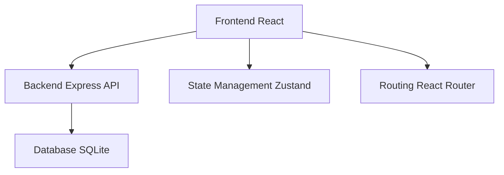
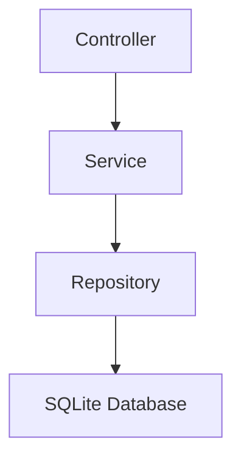
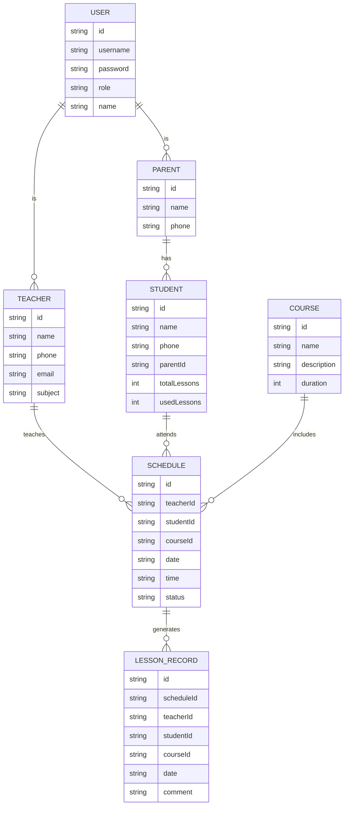

## 1. Architecture Design
本系统采用前后端分离架构，使用 React + Express + TypeScript 技术栈，实现管理员、教师、家长三端一体化管理。



## 2. Technology Description
- Frontend: React@18 + TypeScript + tailwindcss@3 + vite
- Initialization Tool: vite-init
- Backend: Express@4 + TypeScript
- Database: SQLite
- State Management: Zustand
- UI Components: 自定义组件 + lucide-react 图标

## 3. Route Definitions
| Route | Purpose |
|-------|---------|
| /login | 登录页面 |
| /admin/dashboard | 管理员仪表板 |
| /admin/teachers | 师资管理 |
| /admin/students | 学员管理 |
| /admin/courses | 课程管理 |
| /admin/lessons | 课时管理 |
| /admin/schedule | 排班管理 |
| /admin/reports | 数据报表 |
| /teacher/schedule | 教师个人课表 |
| /teacher/students | 授课学员 |
| /teacher/checkin | 课时核销 |
| /parent/profile | 子女档案 |
| /parent/schedule | 上课安排 |
| /parent/lessons | 剩余课时 |
| /parent/comments | 历史评语 |

## 4. API Definitions
### 4.1 Type Definitions
```typescript
interface User {
  id: string;
  username: string;
  role: 'admin' | 'teacher' | 'parent';
  name: string;
}

interface Teacher {
  id: string;
  name: string;
  phone: string;
  email?: string;
  subject: string;
}

interface Student {
  id: string;
  name: string;
  phone: string;
  parentId: string;
  totalLessons: number;
  usedLessons: number;
}

interface Course {
  id: string;
  name: string;
  description?: string;
  duration: number;
}

interface Schedule {
  id: string;
  teacherId: string;
  studentId: string;
  courseId: string;
  date: string;
  time: string;
  status: 'scheduled' | 'completed' | 'cancelled';
}

interface LessonRecord {
  id: string;
  scheduleId: string;
  teacherId: string;
  studentId: string;
  courseId: string;
  date: string;
  comment?: string;
}
```

### 4.2 API Endpoints
```typescript
// Auth
POST /api/auth/login

// Teachers
GET /api/teachers
POST /api/teachers
PUT /api/teachers/:id
DELETE /api/teachers/:id

// Students
GET /api/students
POST /api/students
PUT /api/students/:id
DELETE /api/students/:id

// Courses
GET /api/courses
POST /api/courses
PUT /api/courses/:id
DELETE /api/courses/:id

// Schedule
GET /api/schedule
POST /api/schedule
PUT /api/schedule/:id
DELETE /api/schedule/:id

// Lessons
GET /api/lessons
POST /api/lessons/checkin
```

## 5. Server Architecture Diagram


## 6. Data Model
### 6.1 Data Model Definition


### 6.2 Data Definition Language
```sql
-- Users table
CREATE TABLE users (
    id TEXT PRIMARY KEY,
    username TEXT UNIQUE NOT NULL,
    password TEXT NOT NULL,
    role TEXT NOT NULL,
    name TEXT NOT NULL
);

-- Teachers table
CREATE TABLE teachers (
    id TEXT PRIMARY KEY,
    name TEXT NOT NULL,
    phone TEXT NOT NULL,
    email TEXT,
    subject TEXT NOT NULL
);

-- Parents table
CREATE TABLE parents (
    id TEXT PRIMARY KEY,
    name TEXT NOT NULL,
    phone TEXT NOT NULL
);

-- Students table
CREATE TABLE students (
    id TEXT PRIMARY KEY,
    name TEXT NOT NULL,
    phone TEXT NOT NULL,
    parent_id TEXT NOT NULL,
    total_lessons INTEGER NOT NULL DEFAULT 0,
    used_lessons INTEGER NOT NULL DEFAULT 0,
    FOREIGN KEY (parent_id) REFERENCES parents(id)
);

-- Courses table
CREATE TABLE courses (
    id TEXT PRIMARY KEY,
    name TEXT NOT NULL,
    description TEXT,
    duration INTEGER NOT NULL
);

-- Schedule table
CREATE TABLE schedules (
    id TEXT PRIMARY KEY,
    teacher_id TEXT NOT NULL,
    student_id TEXT NOT NULL,
    course_id TEXT NOT NULL,
    date TEXT NOT NULL,
    time TEXT NOT NULL,
    status TEXT NOT NULL DEFAULT 'scheduled',
    FOREIGN KEY (teacher_id) REFERENCES teachers(id),
    FOREIGN KEY (student_id) REFERENCES students(id),
    FOREIGN KEY (course_id) REFERENCES courses(id)
);

-- Lesson records table
CREATE TABLE lesson_records (
    id TEXT PRIMARY KEY,
    schedule_id TEXT NOT NULL,
    teacher_id TEXT NOT NULL,
    student_id TEXT NOT NULL,
    course_id TEXT NOT NULL,
    date TEXT NOT NULL,
    comment TEXT,
    FOREIGN KEY (schedule_id) REFERENCES schedules(id),
    FOREIGN KEY (teacher_id) REFERENCES teachers(id),
    FOREIGN KEY (student_id) REFERENCES students(id),
    FOREIGN KEY (course_id) REFERENCES courses(id)
);

-- Insert initial admin user
INSERT INTO users (id, username, password, role, name) VALUES 
('admin-001', 'admin', 'admin123', 'admin', '系统管理员');
```
