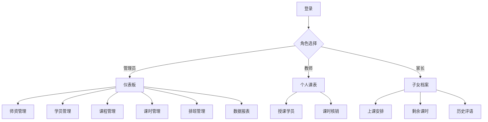

## 1. Product Overview
教培机构三端一体化课时管理系统，实现培训机构日常教务数字化管理，包含管理员总后台、教师端、家长端三个权限端口。
- 解决传统教务管理纸质化、数据分散、课时统计困难等问题
- 提高机构运营效率，实现全角色线上无纸化教务管理

## 2. Core Features

### 2.1 User Roles
| Role | Registration Method | Core Permissions |
|------|---------------------|------------------|
| 管理员 | 系统预置账号 | 管理师资、学员、课程、课时，查看全量数据报表 |
| 教师 | 管理员创建账号 | 查看个人授课学员、排班课表，录入课堂评语，核销课时 |
| 家长 | 管理员创建账号 | 查询子女档案、任课教师、上课安排、剩余课时、历史评语 |

### 2.2 Feature Module
1. **登录页**: 角色选择登录
2. **管理员端**: 仪表板、师资管理、学员管理、课程管理、课时管理、排班管理、数据报表
3. **教师端**: 个人课表、授课学员、课时核销、评语录入
4. **家长端**: 子女档案、上课安排、剩余课时、历史评语

### 2.3 Page Details
| Page Name | Module Name | Feature description |
|-----------|-------------|---------------------|
| 登录页 | 角色选择 | 选择管理员/教师/家长角色登录 |
| 管理员-仪表板 | 数据概览 | 展示学员总数、教师总数、课程总数、今日课时等统计数据 |
| 管理员-师资管理 | 教师列表 | 新增、编辑、删除教师信息 |
| 管理员-学员管理 | 学员列表 | 新增、编辑、删除学员信息，关联家长账号 |
| 管理员-课程管理 | 课程列表 | 新增、编辑、删除课程信息 |
| 管理员-课时管理 | 课时记录 | 查看全量课时消耗记录 |
| 管理员-排班管理 | 课表管理 | 安排教师授课时间，关联学员和课程 |
| 管理员-数据报表 | 统计报表 | 课时消耗统计、师生授课台账 |
| 教师-个人课表 | 课表查看 | 查看个人排班课程表 |
| 教师-授课学员 | 学员列表 | 查看所教授的学员信息 |
| 教师-课时核销 | 核销操作 | 课后核销课时，录入课堂评语 |
| 家长-子女档案 | 档案查看 | 查看子女基础信息和任课教师 |
| 家长-上课安排 | 课表查看 | 查看子女上课时间安排 |
| 家长-剩余课时 | 课时查询 | 查看子女剩余课时数量 |
| 家长-历史评语 | 评语列表 | 查看历史课堂评语 |

## 3. Core Process
### 管理员核心流程
管理员登录 → 管理师资/学员/课程 → 安排课表 → 查看数据报表

### 教师核心流程
教师登录 → 查看个人课表 → 课后核销课时并录入评语

### 家长核心流程
家长登录 → 查看子女档案和课表 → 查询剩余课时和历史评语

## 4. User Interface Design
### 4.1 Design Style
- 主色调：蓝色系 (#1e40af) 代表专业、信任
- 辅助色：青色 (#0ea5e9) 用于强调和交互元素
- 按钮风格：圆角矩形，带有轻微阴影和悬停效果
- 字体：系统字体栈，保持清晰易读
- 布局风格：卡片式布局，顶部导航 + 侧边栏菜单
- 图标风格：使用 lucide-react 线性图标

### 4.2 Page Design Overview
| Page Name | Module Name | UI Elements |
|-----------|-------------|-------------|
| 登录页 | 角色选择 | 居中布局，三个角色卡片，带有渐变背景 |
| 管理员-仪表板 | 数据概览 | 统计卡片网格，图表区域，快捷操作 |
| 管理员-列表页 | 数据管理 | 搜索栏、数据表格、操作按钮 |
| 教师端-课表 | 课表查看 | 周视图课表，课程卡片 |
| 家长端-首页 | 信息展示 | 卡片式信息展示，清晰的层级结构 |

### 4.3 Responsiveness
- 采用桌面优先设计，支持平板和移动设备自适应
- 侧边栏在移动端转为抽屉式菜单
- 表格在移动端支持横向滚动或卡片式展示

### 4.4 3D Scene Guidance
本项目不涉及3D场景。
